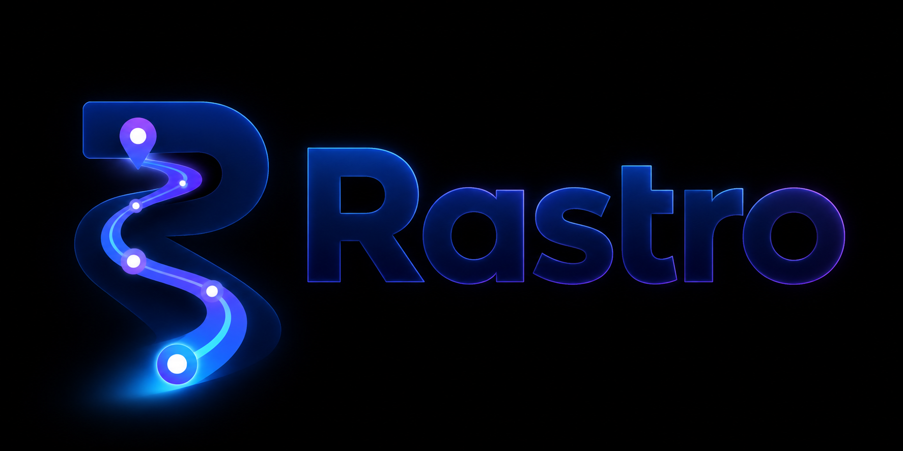
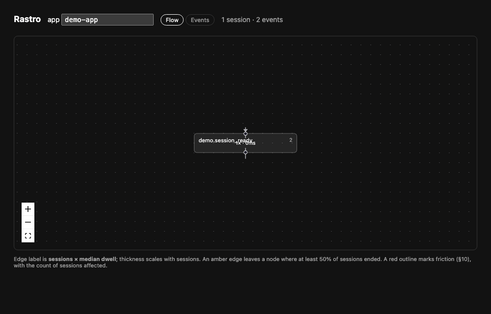

<p align="center">
  
</p>

<p align="center">
  <a href="https://github.com/andrew-schutt/rastro/actions/workflows/ci.yml"></a>
</p>

**See the paths your users actually take — with zero instrumentation.**

Drop one provider into a React app and Rastro reconstructs real user flows from
behavior: which elements people move between, how long they pause, and where they
drop off. No manual event tagging, no flow definitions, no rewrites.

Events are emitted in **OpenTelemetry** format (OTLP), so the same data can flow
into your existing observability stack *and* into Rastro's UX-behavioral analysis.

> ⚠️ **Status: pre-alpha.** APIs, wire shapes, and the `ux.*` conventions are at
> *Development* stability and will change. This is a project built in the open;
> see [`docs/DESIGN.md`](docs/DESIGN.md) for the full design and its open questions.



<sub>The Flow Explorer, live. Someone uses the demo app — navigates, starts filling a form,
hesitates, abandons it, comes back and hammers Save — and the flow, the dwell times, and the
rage click are reconstructed from behaviour alone. No events were tagged to produce this.</sub>

---

## What it is

A developer-native UX-flow tool for React:

1. A tiny SDK (`rastro-react`) auto-captures meaningful interactions and emits
   them as OpenTelemetry Events.
2. A small collector ingests OTLP and stores the events.
3. A pure analysis layer turns raw events into **sessions**, a **flow graph**, and
   **single-session timelines**.
4. A dashboard renders them.

The interesting part — and the whole point — is step 3: turning anonymous DOM
clicks into stable, comparable user behavior. Everything else is deliberately thin.

## Quick start

```bash
pnpm add rastro-react
```

```tsx
import { RastroProvider, otlpExporter } from "rastro-react";

export default function App() {
  return (
    <RastroProvider
      app="my-app"
      exporter={otlpExporter({ endpoint: "http://localhost:4318/v1/logs" })}
    >
      <MyApplication />
    </RastroProvider>
  );
}
```

That's the whole integration. Optional enrichment where auto-capture isn't enough:

```tsx
import { useTelemetry } from "rastro-react";

const { track } = useTelemetry();
track("profile.saved");                 // custom event, same conventions
```

Then run the collector + dashboard locally:

```bash
pnpm --filter collector dev            # OTLP ingest on :4318, graph/session API
pnpm --filter dashboard dev            # flow graph + session timelines
```

No backend handy? Point the SDK at `consoleExporter()` and watch events in the
browser console — zero services required.

## How it works

```
click → capture (stable fingerprint) → OTel Event → OTLP → collector → store
                                                              │
                                                sessionize → flow graph  (aggregate)
                                                           → timeline     (one session)
                                                              │
                                                           dashboard
```

- **Stable element identity.** Rastro derives a fingerprint for each element from
  its React component ancestry + role + accessible name, so "Save Profile" is the
  same node across sessions and small refactors. This is the hard part; see the plan.

  > ⚠️ **In production, install the build plugin.** Identity is anchored on the React
  > component chain, and a production build renames `SaveButton` to `t` — so unrelated
  > elements collapse into one identity, quietly, with no error.
  > [`babel-plugin-rastro`](packages/babel-plugin) fixes this by stamping component names
  > into the DOM at build time, where a minifier cannot reach them; the SDK then derives
  > identity from those instead of from React's internals. **Without it, Rastro is reliable
  > in development and not in a minified production build.** Next.js is not yet supported —
  > it compiles with SWC ([`docs/DESIGN.md`](docs/DESIGN.md) §4.3).
- **OpenTelemetry-native.** Interactions are OTel *Events* (log records), grouped by
  the standard `session.id`. UX meaning rides in a small `ux.*` attribute namespace —
  see [`docs/SEMANTIC-CONVENTIONS.md`](docs/SEMANTIC-CONVENTIONS.md).
- **Analysis is pure.** `sessionize` and `buildGraph` are pure functions over event
  arrays — easy to test with fixture traces, and where all the actual intelligence lives.

## What this deliberately *isn't* (yet)

Scope is narrow on purpose. These are omitted as choices, not oversights — each is a
real feature in mature tools, and each is listed here so the boundary is explicit:

- **Not session replay.** No pixel recording. Single-session *timelines* (the ordered
  path + dwell, reconstructed from events) cover a large fraction of replay's value
  without the capture cost or privacy surface. Full replay (e.g. rrweb) is a later call.
- **Not an AI recommendations engine.** The analytics stand on their own. AI, if added,
  is an interpretation layer over the deterministic metrics — never the engine.
- **Not funnels / segmentation / experimentation / cross-customer benchmarks.** These
  are what analytics platforms (PostHog, Amplitude, Heap) already do well.
- **Not a Grafana Faro replacement.** Faro already does frontend RUM → OTLP → Grafana.
  Rastro is the *behavioral-analysis* layer on top of that kind of data: flow
  reconstruction and friction, not health/error/perf monitoring.

If you need any of the above today, use the tools that have them. Rastro is trying
to do one thing — turn behavior into legible flows — well.

## Project layout

```
packages/core        shared types, fingerprinting, redaction, seam interfaces
packages/react       rastro-react — the SDK
packages/analysis    pure functions: events → sessions → flow graph
apps/collector       Fastify: OTLP ingest + graph/session API
apps/dashboard       Vite + React Flow
examples/demo-app    a React app to dogfood on
```

## Design principles

- **Zero-config first.** Baseline value from the provider alone; semantics are optional
  and incremental.
- **Metadata, not content.** Interaction shape is captured; `ux.accessible_name` is
  redacted and `url.path` is tokenized before emit. Never raw user input.
- **Swap points, not lock-in.** Storage, exporter, fingerprint strategy, redaction, and
  route detection are interfaces (`packages/core/src/seams.ts`). Take the SDK without the
  backend, or the analysis without the SDK.
- **The wire format is standard; the semantics are ours.** OTLP is the envelope; `ux.*`
  is the model. Generic OTel backends are substrate — the UX insight is the analysis layer.

## Documentation

- [`docs/DESIGN.md`](docs/DESIGN.md) — full design, tradeoffs, and open unknowns
- [`docs/SEMANTIC-CONVENTIONS.md`](docs/SEMANTIC-CONVENTIONS.md) — the `ux.*` spec you instrument against
- [`docs/NOTES.md`](docs/NOTES.md) — how to run this repo, and what is implemented vs. stubbed
- [`docs/VALIDATION-PLAN.md`](docs/VALIDATION-PLAN.md) — the next body of work: closing the two de-risking gates
- [`docs/IDENTITY-RESOLUTION.md`](docs/IDENTITY-RESOLUTION.md) — how element identity survives deploys (design, unbuilt)
- [`docs/PRIOR-ART.md`](docs/PRIOR-ART.md) — what this is similar to, and where it actually differs
- [`CONTRIBUTING.md`](CONTRIBUTING.md) — commit, branch, and merge conventions, and what counts as verified

## License

[MIT](LICENSE) © 2026 Andrew Schutt
